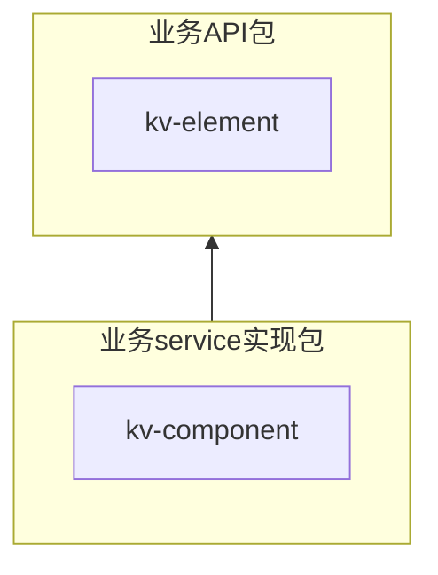
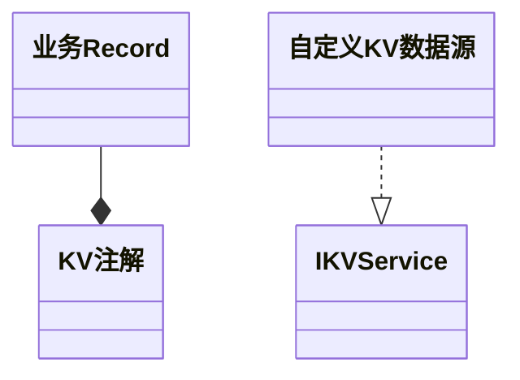

# kv 转换工具
通过缓存一些字典或自定义转换的数据，达到查key回显value的效果。
目前实现用的guavaCache与jetCache，其中jetCache 需要原本项目对其的支持，默认guavaCache
## 推荐架构结合：




## 使用方式：
1、引入编译好的的jar
```java
API相关包中加入依赖
<dependency>
    <groupId>com.jblue</groupId>
    <artifactId>kv-element</artifactId>
    <version>${project.version}</version>
</dependency>

 service相关包中加入依赖

<dependency>
    <groupId>com.jblue</groupId>
    <artifactId>kv-component</artifactId>
    <version>${project.version}</version>
</dependency>

```

2、在API的DO对象上加上注解 '@KV'
其中 'name'是之前定义的服务名，带relate的会去取属性值对应的字段的值，没有的就直接取设置的值
```java
    private String examBody;

    //使用“approveType”缓存，关联属性1为"hosId",以“examBody”属性的值作为key
    @KV(name = "approveType", fixedPar1 = "hosId", relateKey = "examBody")
    private String examBodyName;
```

3、定义转换方法，在service中实现IKVService接口
```java
@KVCache("approveType")
public class ApproveTypeNameKVServiceImpl implements IKVService<DefaultCacheObject> {
    //此处可以是其他rpc调用，或者单纯的Enum枚举类提供基础数据
    @DubboReference
    private ApproveTypeService approveTypeService;

    //此处是为了项目启动时加载相关字典数据做到初始化用的
    @Override
    public List<DefaultCacheObject> list() {
        return new ArrayList<>();
    }

    @Override
    public DefaultCacheObject select(String s) {
        BaseCacheObject bo = getObject(s);
        try {
            if (StringUtils.isEmpty(bo.getKVkey())) {
                return (DefaultCacheObject) bo;
            }
            Long hosId = StringUtils.isEmpty(bo.getPar1()) ? null : Long.valueOf(bo.getPar1());
            List<ApproveType> list = approveTypeService.listByTypeAndHosId(bo.getKVkey(), hosId);
            if (CollectionUtils.isNotEmpty(list)) {
                bo.setKVvalue(list.get(0).getTypeName());
            }
        } catch (Exception e) {
            log.error("KV " + this.getClass() + " Info error:", e);
        }
        return (DefaultCacheObject) bo;
    }
}
```
通过注解定义服务名“approveType”，并实现缓存的获取数据方式

4、缓存目前可通过spring自定义一些参数
```yaml
#相关配置均有默认值，可为空
jblue:
  kv:
    #缓存方式目前分为 guavaCache 与 jetCache，其中jetCache 需要原本项目对其的支持，目前默认guavaCache
    cacheType: guavaCache
    #通用属性
    cacheProperty:
      #缓存刷新时间 默认5分钟
      refreshSeconds: 300
      #缓存刷新时间偏移量 1分钟的随机差(防止多个缓存集体同时刷新导致高负载)
      refreshSecondsOffset: 60
      #缓存队列默认长度
      cacheNumber: 10000
    #也可以根据不同的缓存自定义属性
    caches:
      itemType:
        #缓存刷新时间 默认5分钟
        refreshSeconds: 300
        #缓存刷新时间偏移量 1分钟的随机差(防止多个缓存集体同时刷新导致高负载)
        refreshSecondsOffset: 60
        #缓存队列默认长度
        cacheNumber: 10000
      

```

5、通过KVUtil暴露的方法（如 KVUtil.convertKV(Object o)）达到将Object o对象中数据进行转换

6、对使用mybatis的项目，通过@EnableMybatisKV启动mybatis插件，查询数据后自动调用kv组件进行kv转换达到数据库查到为“3”但是对象被赋值为字典值“已通过”的效果


# kv 数据脱敏工具
依赖方式与使用方式同转换工具，唯一区别是bean上的注解换成 @Desensitise
```java
    //使用姓名脱敏
    @Desensitise(type = SensitiveTypeEnum.CHINESE_NAME)
    private String userName;
```